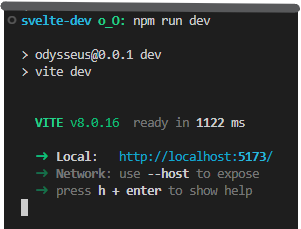
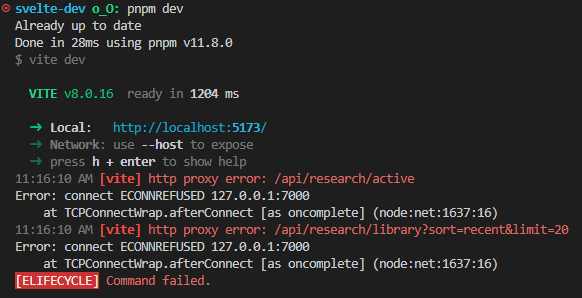
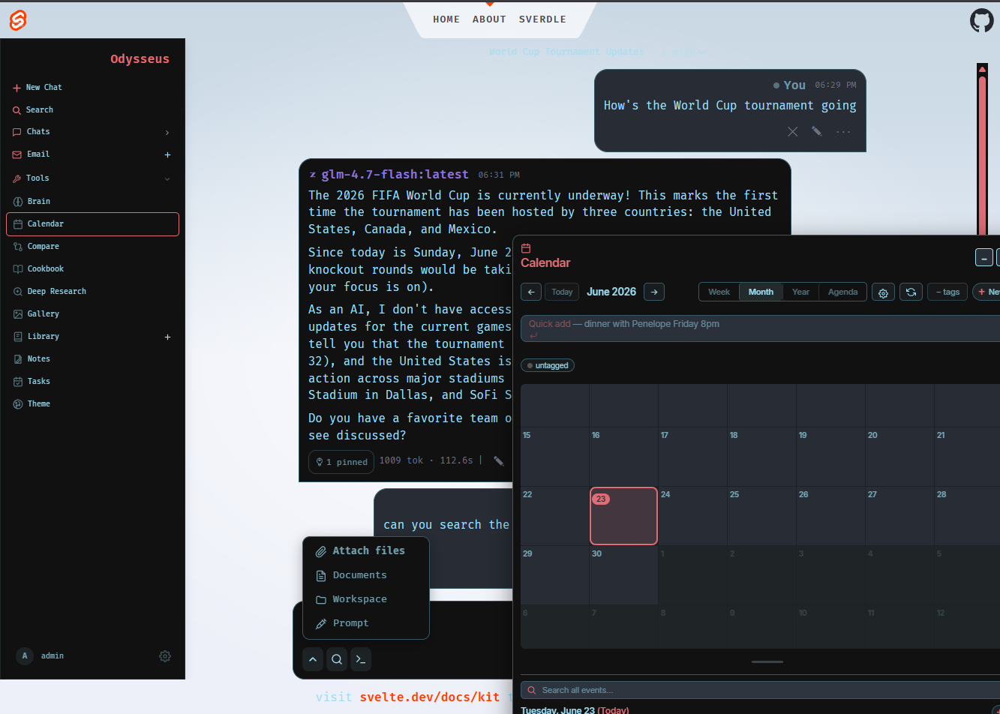

 <p align="center">
  
</p>

## SvelteKit POC Version

This POC (proof of concept) is a frontend-focused, gradual-rewrite-ready fork of the Odysseus app, with a **static adapter** to **SvelteKit**.

> The existing FastAPI backend continues to serve the static bundle and handle api calls exactly as before, making this fork a **drop‑in replacement** for the current frontend.
>
> **Note** this fact in the *Development* section below.

Out of the box benefits include client-side routing, state and effect handling, prefetching, and other optimizations (provided by sveltekit, vite).

### What This POC Demonstrates

○ Incremental modernization ○ Static-first architecture ○ Efficient onboarding for new features ○ Improved development, performance and UX ○ Cleaner separation of concerns

<details>
<summary>
details:
</summary>

- **Incremental modernization**
  The legacy HTML/JS/CSS structure is decomposed into Svelte components, layouts, and modules. This allows targeted rewrites without requiring a full migration upfront.

- **Static-first architecture**
  Using `adapter-static` keeps deployment simple and compatible with the existing FastAPI hosting model. No SSR, no Node server, no runtime dependencies.

- **Faster, friendlier onboarding for new features**
  By breaking apart monolithic UI logic, new screens, widgets, and flows can be added with significantly less friction. Components are isolated, typed, and easier to reason about.  Use javascript or typescript with a simple script attribute choice (lang="ts/js"). View your logic, html, and styles all in the same document.

- **Improved development, performance and UX**
  SvelteKit’s dev server provides hot reload, with a no-config ability to interact with the backend. The client-side router enables instant navigation between pages, built‑in prefetching, and smoother transitions. The bundle is optimized by Vite, and unused code is tree‑shaken automatically, speeding up loading times.

- **Cleaner separation of concerns**
  The frontend no longer needs to manage global scripts or shared DOM state. Each feature lives in its own component, with scoped styles and predictable lifecycle behavior.

</details>

### Why SvelteKit (Static) Was Chosen for the POC

Odysseus already has a backend capable of serving static assets. SvelteKit’s static adapter allows us to:

- preserve the current deployment model
- modernize the UI incrementally
- avoid introducing new operational complexity
- keep the bundle lightweight and portable

It’s a low-risk path toward a future full rewrite - while still delivering immediate improvements to maintainability and user experience.

### Project Structure Overview

In order to get aligned with this project, coming from the main project, there are a few quick things to note, and then the rest should fall into place.

<details>
<summary>
details:
</summary>

- Svelte code lives in `web`.
- Nearly all .js files from `/static/js` have been moved to `/web/lib/legacy`.
  - They have also been modified slightly, to fit the svelte environment.
    - `import {abc} from 'static/js/moduleName'` becomes `import {abc} from '$lib/legacy/moduleName'`
    - Any TOP-LEVEL 'DOM READY' code or self-firing code has been, or will be moved to the given module's `init` method.
      - eg. `document.getElementById`, `window.moduleName = moduleName`, `(function _abc(){})())`
      - in all other instances, these are fine (though sub-optimal. They would be deprecated by the end of a full rewrite in favor of using the framework)
    - `init` at will handle one-time initialization, and be called from `onMount` (inside of a svelte page / layout / component).
  - If you're looking for an existing & more sparsely defined `init` method for a module that takes api_base as an argument, that method is now called `initLegacy`.

```
web/
  entries/       # Near deprecated - served components-as-widget
  lib/           # Shared utilities, stores, and modules
    components/  # Reusable or standalone UI components ()
    legacy/      # Legacy frontend code, now svelte-compatible!
  routes/        # SvelteKit pages and endpoints (static)
    about/       # Just a page to find navigation bugs / play with
    chat/        # Nearly the whole app (from legacy index.html)
    demo/        # deprecated, from svelte project init
    login/       # Yes, the login page (from legacy login.html)
    sverdle/     # Accessible from the About page if you get bored
                 # (also) deprecated, from svelte project init
  app.html       # Custom app template (from legacy index.html)
svelte.config.js # Sets 'web' and 'web-build' dirs, fallback
vite.config.js   # Sets plugins (eg. tailwind), demo proxy
web-build/       # build output - FastAPI serves this index.html
```

</details>

### Development Workflow

The dev server provides full SSR-like behavior (hot reload, server-side dynamic routing, etc.), but the final build is fully static:

```
pnpm install
pnpm build:app
pnpm dev
```

`pnpm dev` is only a shortcut to testing changes *when the backend / app is already running*.

| Odysseus running | Odysseus stopped |
| :--------------: | :--------------: |
|  |  |
| Use `pnpm dev` to test front-end changes. | Start Odysseus to test current state. Then use `pnpm dev` to test further front-end changes. |

If using **docker**, there's no need to run `docker compose up -d --build` to test every front-end change. Deploy it once, and use the same instructions above. Deploy again when done (to run the back-end tests that still touch the front-end).

#### Testing

A frontend test framework is now in place (vitest).

Unit tests will be run as part of the usual tests (`python -m pytest`) under `test_frontend_vi_svelte.py`.

To run them manually, use `pnpm unit`

---

<p align="center">
  A self-hosted AI workspace for chat, agents, research, documents, email, notes, calendar, and local model workflows.
</p>

<p align="center">
  <a href="#quick-start">Quick Start</a> ·
  <a href="docs/setup.md">Setup Guide</a> ·
  <a href="CONTRIBUTING.md">Contributing</a> ·
  <a href="ROADMAP.md">Roadmap</a>
</p>

<p align="center">
  <a href="https://repology.org/project/odysseus-ai/versions"></a>
</p>

<p align="center">
  
</p>

---

## Running through SvelteKit


If you do not see the svelte header and footer, you've reached a fallback page. Check the console for errors.

---

## Quick Start

### SvelteKit POC Version Repo notes

You can follow the legacy build and run steps as they are after you've compiled the svelte frontend with `npm run build`.


`svelte-dev` is the default development branch.

There is no fast-tracking `main` branch, but `svelte` exists - Major versions will exist there if we get that far.

---

### Legacy Quick Start


> `dev` is the default branch and gets the newest changes first. Use [`main`](https://github.com/odysseus-dev/odysseus/tree/main) if you want the more curated branch.

```bash
git clone https://github.com/odysseus-dev/odysseus.git
cd odysseus
cp .env.example .env
docker compose up -d --build
```

Open `http://localhost:7000` when the containers are healthy. The first admin password is printed in `docker compose logs odysseus`.

Native installs, GPU notes, Windows/macOS instructions, HTTPS, and configuration live in the [setup guide](docs/setup.md).

## Features

- **Chat + Agents** — local/API models, tools, MCP, files, shell, skills, and memory.
- **Cookbook** — hardware-aware model recommendations, downloads, and serving.
- **Deep Research** — multi-step web research with source reading and report generation.
- **Compare** — blind side-by-side model testing and synthesis.
- **Documents** — writing-first editor with AI edits, suggestions, Markdown, HTML, CSV, and syntax highlighting.
- **Email** — IMAP/SMTP inbox with triage, tags, summaries, reminders, and reply drafts.
- **Notes, Tasks + Calendar** — reminders, todos, scheduled agent tasks, and CalDAV sync.
- **Extras** — gallery/image editor, themes, uploads, web search, presets, sessions, and 2FA.

## Demo

A full hover-to-play tour lives on the landing page: [`docs/index.html`](docs/index.html).

## Contributing

Help is welcome. The best entry points are fresh-install testing, provider setup bugs, mobile/editor polish, docs, and small focused refactors. See [CONTRIBUTING.md](CONTRIBUTING.md) and [ROADMAP.md](ROADMAP.md).

## Security

Odysseus is a self-hosted workspace with powerful local tools. Keep auth enabled, keep private data out of Git, and do not expose raw model/service ports publicly. Deployment details are in the [setup guide](docs/setup.md#security-notes).

## Star History

<a href="https://www.star-history.com/?repos=odysseus-dev%2Fodysseus&type=date&legend=top-left">
 <picture>
   <source media="(prefers-color-scheme: dark)" srcset="https://api.star-history.com/chart?repos=odysseus-dev/odysseus&type=date&theme=dark&legend=top-left" />
   <source media="(prefers-color-scheme: light)" srcset="https://api.star-history.com/chart?repos=odysseus-dev/odysseus&type=date&legend=top-left" />
   
 </picture>
</a>

## License

AGPL-3.0-or-later -- see [LICENSE](LICENSE) and [ACKNOWLEDGMENTS.md](ACKNOWLEDGMENTS.md).

